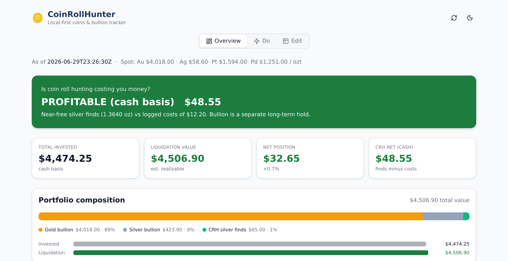
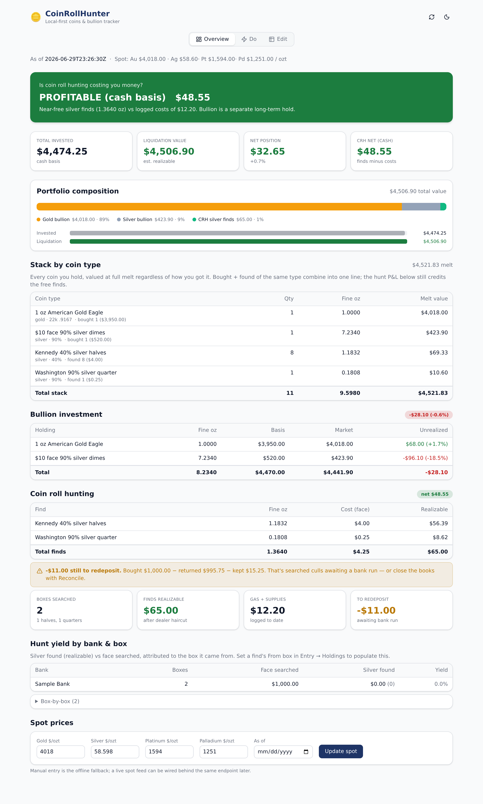
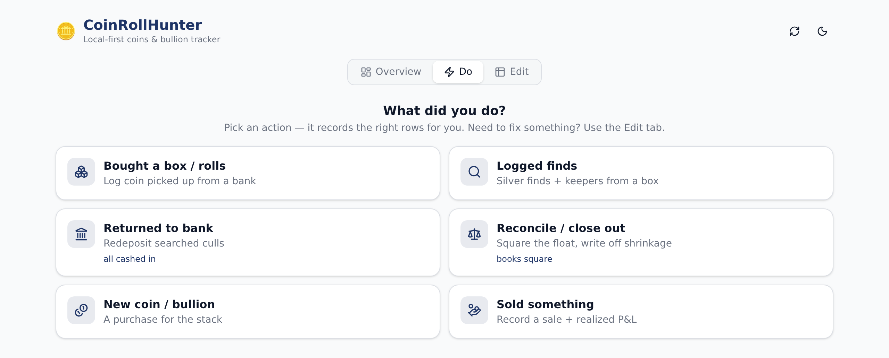
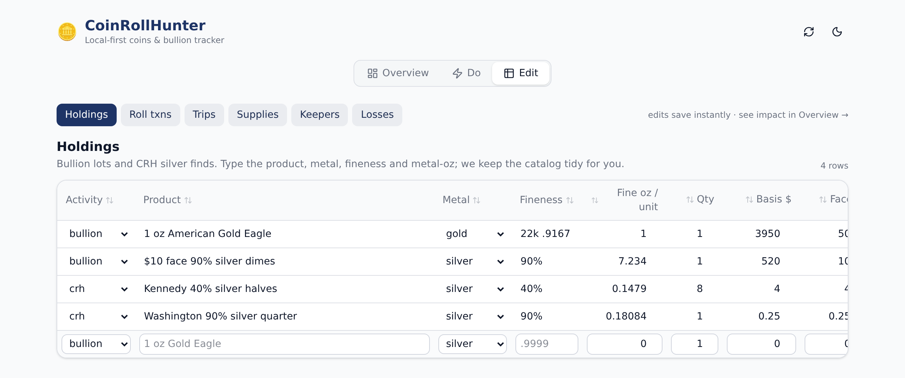

# CoinRollHunter

**Track coin roll hunting (CRH) and precious-metals bullion together — and finally answer
the question that matters: _is the hunt actually paying for itself?_**

Local-first and private: your holdings live in a SQLite file on your own machine and never
leave it. No account, no cloud, no telemetry. It ships as a single cross-platform binary —
run it and open the dashboard in your browser.

<p align="center">
  
</p>

<p align="center">
  <b><a href="https://github.com/tompscanlan/coinrollhunter/releases/latest">⬇&nbsp; Download for macOS · Windows · Linux</a></b><br>
  <sub>free / pay what you want · no account · runs entirely on your machine</sub>
</p>

---

## Why

- **Knows if coin roll hunting is paying off.** Near-free silver finds vs. the real costs
  (face redeposited short, gas, supplies, shrinkage) → one honest cash-basis verdict.
- **Bullion and the hunt, side by side but separate.** Your long-term stack (what it's worth
  at today's spot vs. what you paid) and CRH cash-flow answer different questions — kept apart
  on purpose, so a gold dip never hides the fact that the hunt is in the black.
- **Mirrors the hobby, not a spreadsheet.** The **Do** tab is the *verbs* you actually do —
  *Bought a box · Logged finds · Returned to bank · Reconcile · New coin · Sold* — and it
  records the right rows for you. The raw grids are still there in **Edit** for corrections.
- **Local-first by construction.** One SQLite file, on your machine. Privacy is the design,
  not a setting.
- **One file, every platform.** Pure-Go SQLite (no CGO) means a single static binary for
  macOS, Windows, and Linux — no install, no runtime, no dependencies.

## What it looks like

**The dashboard** — is the hunt paying for itself, what's the stack worth, what's left to redeposit:



**The “Do” tab** — log what you actually did; it writes the right rows:



**The “Edit” tab** — spreadsheet-style grids whenever you want to edit directly:



## Download & run

1. Grab the archive for your OS from the [latest release](https://github.com/tompscanlan/coinrollhunter/releases/latest).
2. Unpack it.
3. **Double-click it** — `CoinRollHunter.exe` on Windows, `coinrollhunter` on macOS/Linux.

That's it. The app starts and opens your dashboard in a browser window. No terminal, no
URL to type. Quit it with the ⏻ button in the top right.

Your data is saved to a single SQLite file in your user data directory:

| | |
|---|---|
| **Windows** | `%LOCALAPPDATA%\CoinRollHunter\crh.db` |
| **macOS** | `~/Library/Application Support/CoinRollHunter/crh.db` |
| **Linux** | `~/.local/share/coinrollhunter/crh.db` |

Back it up by copying that file. (If you already have a `crh.db` sitting next to the
binary — how earlier versions worked — that one keeps being used, so upgrading never
loses your holdings.)

> **Unpack it first.** Windows will happily run an `.exe` straight from inside the zip
> preview, but it does that by unpacking to a temporary folder that gets cleaned up later.
> Drag the folder out of the zip before you click.

> **Unsigned binaries.** The releases aren't code-signed yet, so the first launch trips
> Gatekeeper (macOS: right-click → **Open**, then **Open**) or SmartScreen (Windows:
> **More info → Run anyway**). The source is right here if you'd rather build it yourself.

### From a terminal

Every subcommand still works. On Windows use `cli\coinrollhunter.exe` — the top-level
`CoinRollHunter.exe` is built for the GUI subsystem and can't print to a console.

```bash
./coinrollhunter serve --db crh.db --addr 127.0.0.1:8787
```

Want to see it populated before entering your own holdings? Run the demo:

```bash
./coinrollhunter demo              # then open http://127.0.0.1:8787
```

That seeds a **separate** `demo.db` with ~15 months of fictional hunting — ~$44k face
searched across ~500 buys, a bullion stack, trophies, sales, an outstanding float — so
every screen has something on it, including the hit-rate grid with honest low-sample
warnings. Poke, edit, and delete freely; it never touches your real `crh.db`. Start over
any time with `./coinrollhunter demo --reset`.

There's also a smaller fixture if you prefer the importer route:

```bash
./coinrollhunter migrate \
  --holdings sample-data/pm_holdings.sample.json \
  --crh sample-data/crh_ledger.sample.json
./coinrollhunter serve
```

## Privacy

Your holdings are yours. `pm_holdings.json`, `crh_ledger.json`, and every `*.db` are
git-ignored and never committed — only fictional `*.sample.json` files live in this repo.
The app makes no network calls except an optional spot-price lookup, and even that has a
manual-entry fallback.

## Build from source

Needs Go 1.26 and Node 22.

```bash
make build            # builds the Svelte UI, then the Go binary with the UI embedded
make run              # build + serve in one step
make release          # cross-compile archives for every platform into dist/
```

For UI development with hot reload, run the Go API (`./coinrollhunter serve`) and, in
another shell, `cd web/app && npm run dev` — Vite proxies `/api` to the Go server.

Pushing a tag (`git tag v0.1.0 && git push origin v0.1.0`) triggers the release workflow,
which builds and publishes the cross-platform archives to a GitHub Release.

## What's here

- `cmd/coinrollhunter` — the single binary (`migrate`, `serve`, `demo`, `version`).
- `internal/` — `model`, `calc` (the profitability engine), `store` (SQLite), `legacy`
  (sample/JSON importer), `api` (REST), `demo` (the fictional demo-dataset seeder).
- `web/app` — the Svelte 5 + Vite + Tailwind UI (shadcn-style components, TanStack editable
  grids), built to `web/dist` and embedded via `go:embed`.
- `docs/ADR-*` — the architecture decisions (single Go binary + SQLite, the UI/monetization/
  spot stack, the catalog/specimen data model, reconcile/shrinkage, the find taxonomy).
- `sample-data/` — a fictional dataset (`*.sample.json`) for trying the app and for tests.
- `CLAUDE.md` — context for picking the project back up in a Claude Code / CLI session.

## License

MIT © 2026 Tom Scanlan
